# ros_motion_planning

## <span id="1">01. Example video


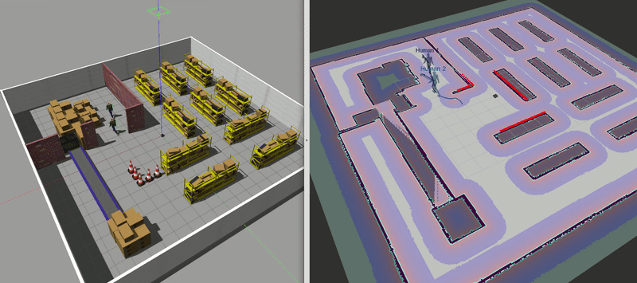


## <span id="2">02. Install Direction

0. Install Ubuntu 20.04 LTS.
    ```bash
    1. Download VMware workstation.
    https://www.vmware.com/products/workstation-pro/workstation-pro-evaluation.html
    
    2. Download Ubuntu 20.04 desktop
    https://releases.ubuntu.com/focal/
    
    3. Ubuntu 20.04 System Installation
    Follow the guidance of installation. (https://blog.csdn.net/qq_59134387/article/details/126843818?ops_request_misc=%257B%2522request%255Fid%2522%253A%2522170411982516800197055116%2522%252C%2522scm%2522%253A%252220140713.130102334..%2522%257D&request_id=170411982516800197055116&biz_id=0&utm_medium=distribute.pc_search_result.none-task-blog-2~all~top_click~default-1-126843818-null-null.142^v99^pc_search_result_base5&utm_term=ubuntu%2020.04%20&spm=1018.2226.3001.4187)
    
    ```

1. Install ROS Noetic (Desktop-Full).
    ```bash
    Follow the following guidance to install the ros noetic in the previous ubuntu 20.04
    https://wiki.ros.org/noetic/Installation/Ubuntu
    ```

2. Install git.
    ```bash
    sudo apt install git
    ```

3. Other dependence.
    ```bash
    sudo apt install python-is-python3 \
    ros-noetic-amcl \
    ros-noetic-base-local-planner \
    ros-noetic-map-server \
    ros-noetic-move-base \
    ros-noetic-navfn
    ```

4. Clone the reposity.
    ```bash
    git clone https://github.com/RamboLan1/ros_motion_planning.git
    ```

5. Compile the code. 
    ```bash
    cd ros_motion_planning/
    catkin_make
    # or catkin build
    # you may need to install it by: sudo apt install python-catkin-tools
    ```

6. Execute the code.
    ```bash
    cd scripts/
    ./main.sh
    ```


## <span id="3">03. Details of algorithm

### Global Planner

| Planner | Version | Animation |
|:-------:|:-------:|:---------:|
|     **GBFS**     |      [](https://github.com/ai-winter/ros_motion_planning/blob/master/src/core/global_planner/graph_planner/src/a_star.cpp)       |            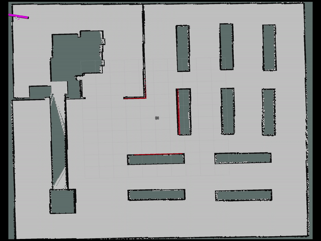            |
|   **Dijkstra**   |      [](https://github.com/ai-winter/ros_motion_planning/blob/master/src/core/global_planner/graph_planner/src/a_star.cpp)       |        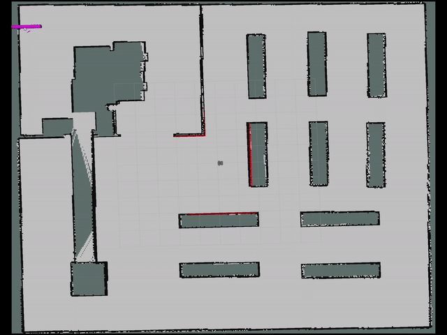        |
|     **A\***      |      [](https://github.com/ai-winter/ros_motion_planning/blob/master/src/core/global_planner/graph_planner/src/a_star.cpp)       |          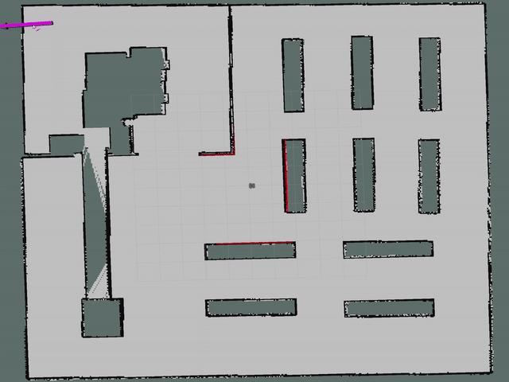          |
|     **JPS**      | [](https://github.com/ai-winter/ros_motion_planning/blob/master/src/core/global_planner/graph_planner/src/jump_point_search.cpp) |             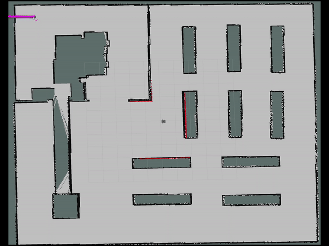             |
|     **D\***      |     []((https://github.com/ai-winter/ros_motion_planning/blob/master/src/core/global_planner/graph_planner/src/d_star.cpp))      |          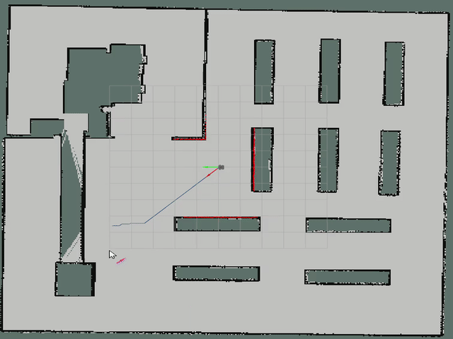          |
|    **LPA\***     |    []((https://github.com/ai-winter/ros_motion_planning/blob/master/src/core/global_planner/graph_planner/src/lpa_star.cpp))     |        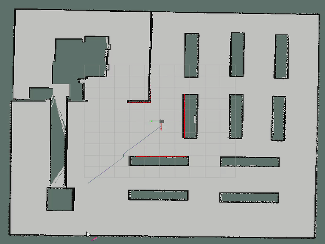        |
|   **D\* Lite**   |   []((https://github.com/ai-winter/ros_motion_planning/blob/master/src/core/global_planner/graph_planner/src/d_star_lite.cpp))   |     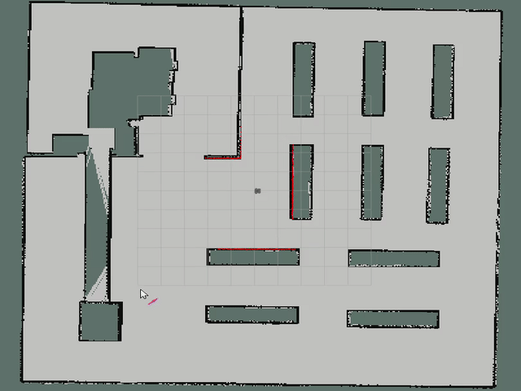     |
|   **Voronoi**    |     []((https://github.com/ai-winter/ros_motion_planning/blob/master/src/core/global_planner/graph_planner/src/voronoi.cpp))     |                  |
|   **Theta\***    |   []((https://github.com/ai-winter/ros_motion_planning/blob/master/src/core/global_planner/graph_planner/src/theta_star.cpp))    |      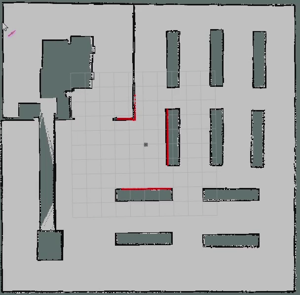      |
| **Lazy Theta\*** | []((https://github.com/ai-winter/ros_motion_planning/blob/master/src/core/global_planner/graph_planner/src/lazy_theta_star.cpp)) | 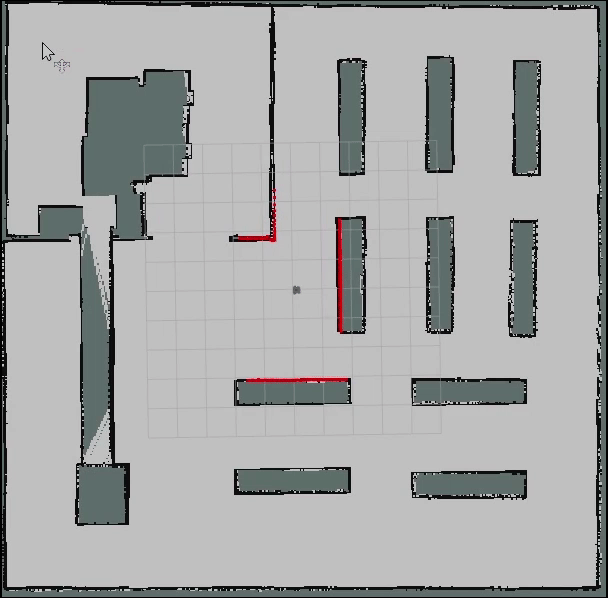 |
|     **RRT**      |       [](https://github.com/ai-winter/ros_motion_planning/blob/master/src/core/global_planner/sample_planner/src/rrt.cpp)        |                          |
|    **RRT\***     |     [](https://github.com/ai-winter/ros_motion_planning/blob/master/src/core/global_planner/sample_planner/src/rrt_star.cpp)     |        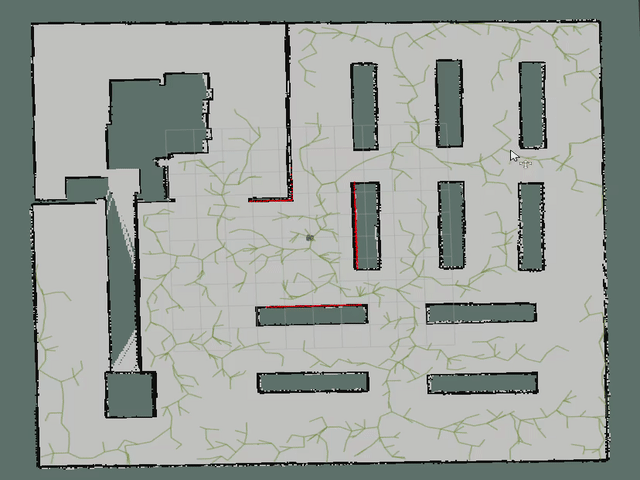        |
| **Informed RRT** |   [](https://github.com/ai-winter/ros_motion_planning/blob/master/src/core/global_planner/sample_planner/src/informed_rrt.cpp)   |        |
| **RRT-Connect**  |   [](https://github.com/ai-winter/ros_motion_planning/blob/master/src/core/global_planner/sample_planner/src/rrt_connect.cpp)    |     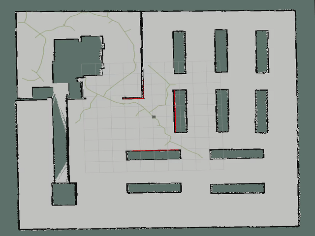     |

### Local Planner

| Planner | Version | Animation |
|:-------:|:-------:|:---------:|
|   **PID**   | [](https://github.com/ai-winter/ros_motion_planning/blob/master/src/core/local_planner/pid_planner/src/pid_planner.cpp) |                       |
|   **DWA**   |     [](https://github.com/ai-winter/ros_motion_planning/blob/master/src/core/local_planner/dwa_planner/src/dwa.cpp)     |           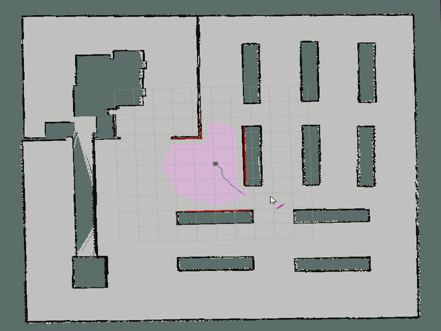            |
